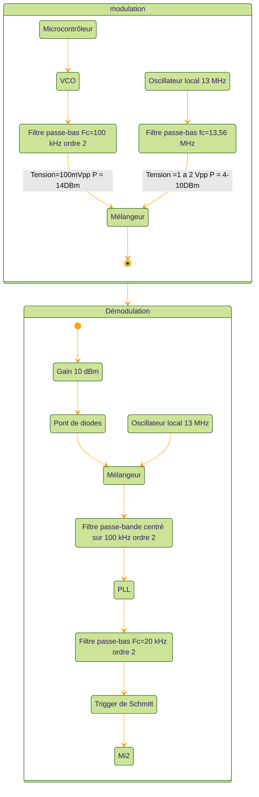
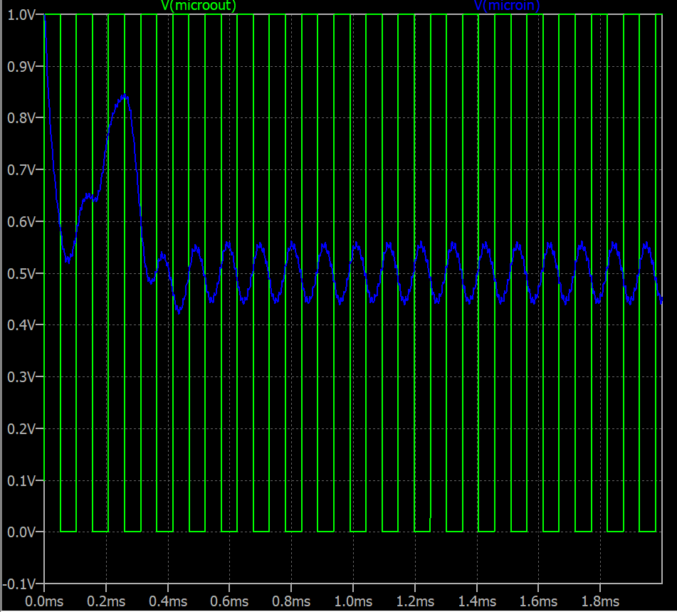
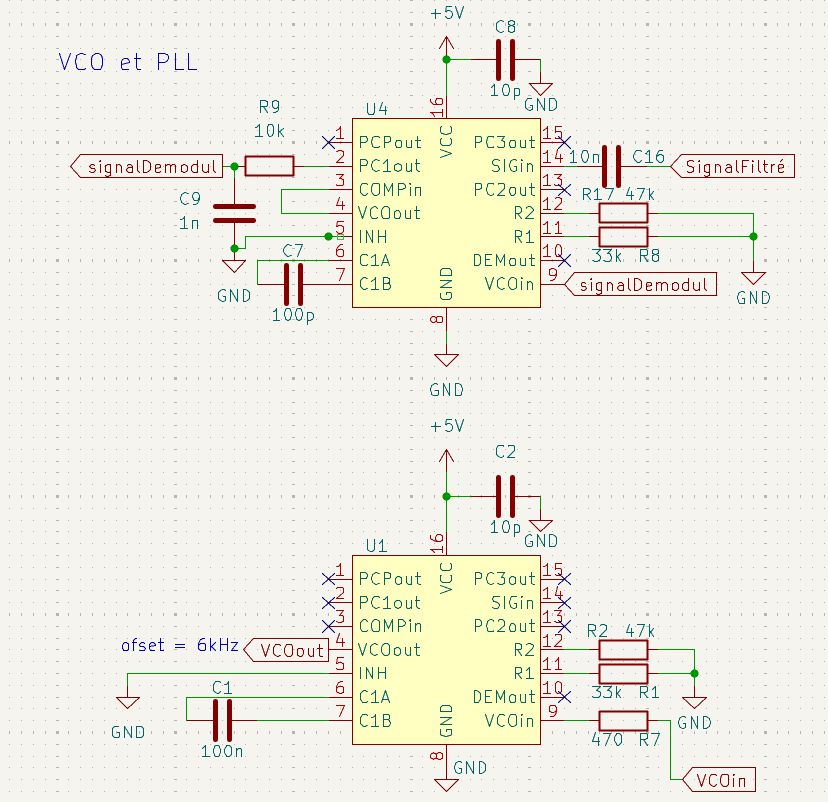

# Modulation haute fréquence

## Diagramme de fonctionnement théorique

| | Valeur |
| ------ | ------ |
| Signal UART | 9600 bps |
| Fréquence porteuse | 100 kHz |
| Fréquence d'émission | 13,56 MHz |
| Puissance d'émission | 10 dBm |

Le gain de la partie démodulation se fait avec un AOP transimpédance si, à la sortie de l'antenne, on doit amplifier le signal.  
Le pont diviseur sert à bien avoir la bonne puissance en entrée du mélangeur.

## Simulation LTspice

Le VCO, la PLL et les mélangeurs n'étant pas répertoriés sur LTspice, ils sont simulés avec des lignes de commande.

| Composant | Ligne de commande |
| ------ | ------ |
| VCO modulation | `Bvco vcomod 0 V = 2.5 + 2.5*sgn(sin(2*pi*idt( {Fp}*(1 + 0.05*(V(microout) - 0.5)) )))` |
| Mélangeur modulation | `bvmel1 mel 0 V = V(filtre_100k)*V(filtre_13M)` |
| VCO démodulation | `Bvcodemod Vco 0 V = 2.5 + 2.5*sgn(sin(2*pi*idt( {Fp}*(1 + 0.1*(V(Demodul) - 0.5)))))` |
| Mélangeur démodulation | `bvmel2 mel2 0 V = V(mel)*V(oscilateur)` |

### Paramètres de simulation

| Paramètre | Valeur |
| ------ | ------ |
| Tsim | 5 ms |
| F | 9600 Hz |
| F13 | 13 560 000 Hz |
| Fp | 100 000 Hz |

## Schémas KiCad théoriques

L'adaptation d'impédance de l'antenne se fait sur une petite carte reliée par un câble BNC.

## Mise en pratique

Lors de la livraison des composants, nous n'avons pas reçu de 74HC4046 mais des CD4046BE. Bien que ce composant ait les mêmes fonctionnalités que le composant que nous avions choisi, son dimensionnement est bien différent pour les valeurs de résistance nécessaires.

Le VCO n'oscille plus à 100 kHz mais autour de 130 kHz. C'est entre autres dû à la datasheet du composant, qui n'est pas très lisible :

[lien datasheet CD4046BE](https://www.ti.com/lit/ds/symlink/cd4046b.pdf?HQS=dis-dk-null-digikeymode-dsf-pf-null-wwe&ts=1780683578275&ref_url=https%253A%252F%252Fwww.ti.com%252Fgeneral%252Fdocs%252Fsuppproductinfo.tsp%253FdistId%253D10%2526gotoUrl%253Dhttps%253A%252F%252Fwww.ti.com%252Flit%252Fgpn%252Fcd4046b)

## Travail réalisé

- [x] VCO et modulation à basse fréquence
- [x] PLL et démodulation à basse fréquence
- [ ] Utilisation du mélangeur pour basculer en haute fréquence
- [ ] Adaptation en impédance de l'antenne
- [ ] Utilisation du mélangeur pour basculer en basse fréquence

## Test de bon fonctionnement

Pour vérifier le bon fonctionnement, j'ai effectué des mesures à l'oscilloscope en entrée et en sortie d'une liaison VCO-PLL avec, en entrée et en sortie, un microcontrôleur RP2040 choisi pour ses deux canaux UART et parce que les tensions de sortie UART correspondent aux microcontrôleurs utilisés dans notre système de surveillance (soit 3,3 V).

J'ai ensuite envoyé une série de 100 messages similaires à ceux qui sont envoyés entre le digicode et le hub, puis j'ai comparé le message d'origine avec le message reçu.

J'ai au maximum 10 messages reçus avec une erreur ou plus, soit 10 % d'erreur maximale de transmission en basse fréquence.