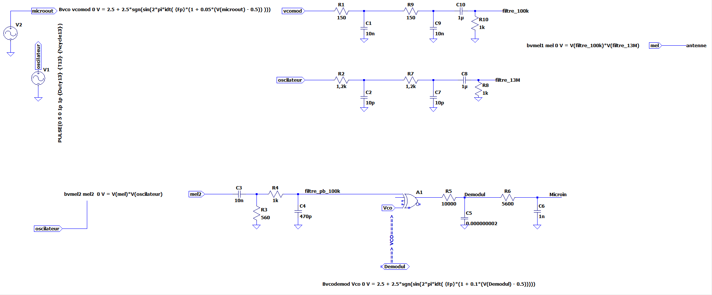
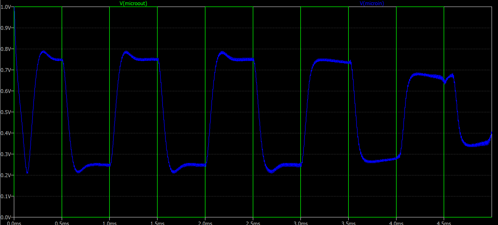
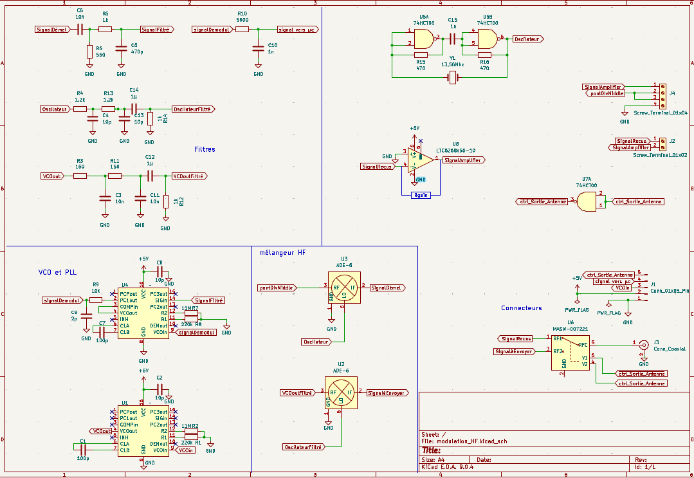
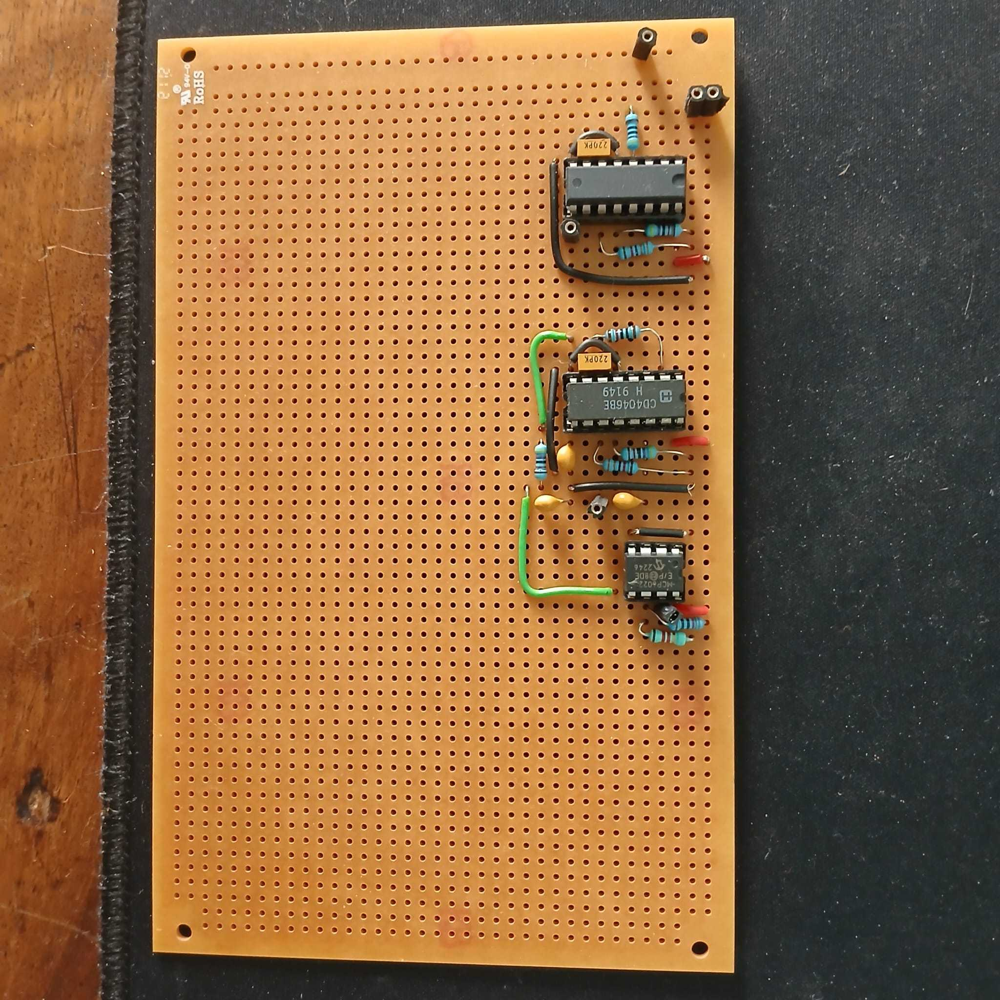
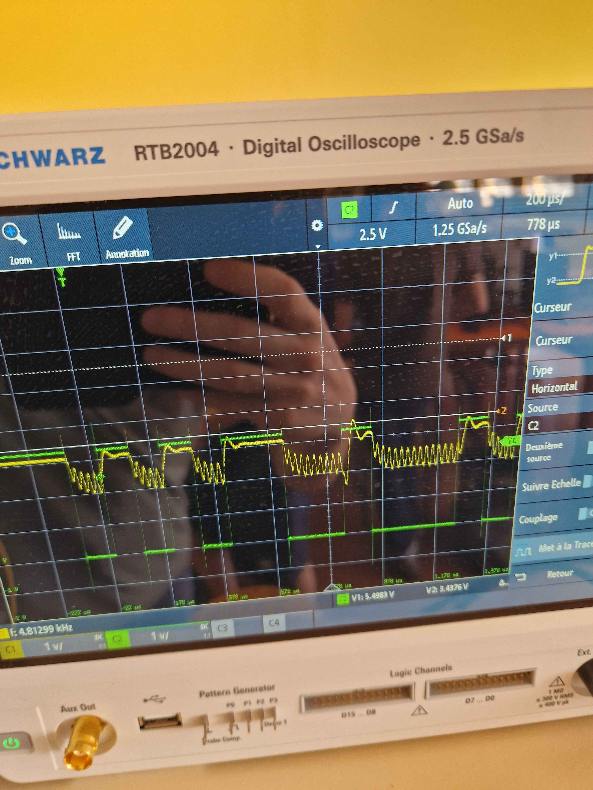
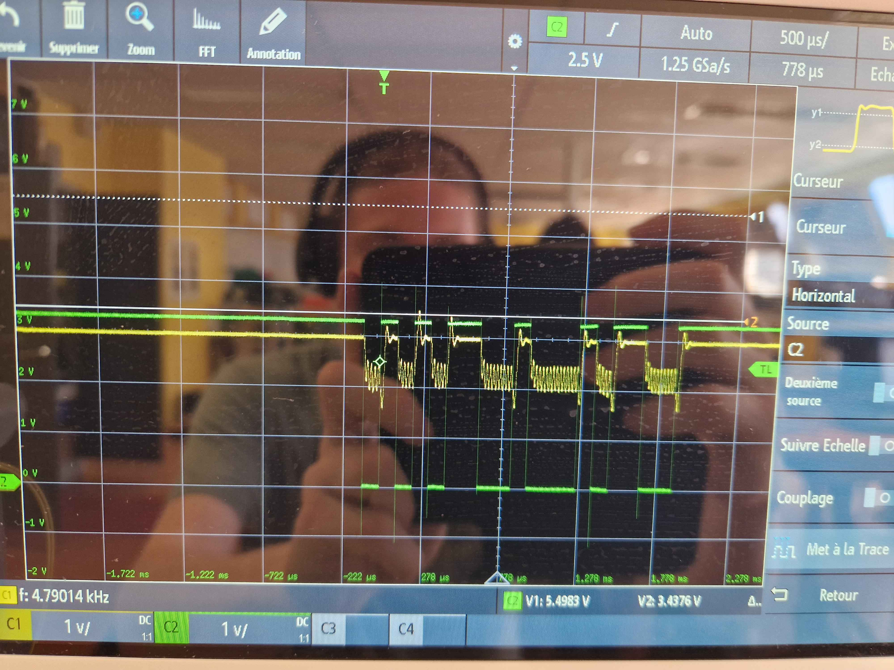
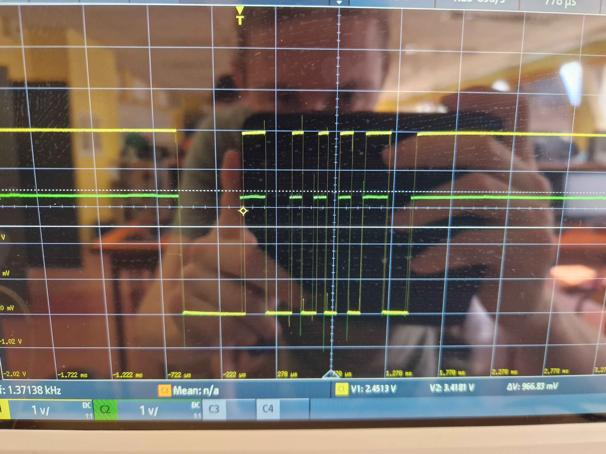

# Modulation Haute fréquence:

## diagrame  de fonctionnement théorique:
| | Valeur |
| ------ | ------ |
| signal UART| 9600bps|
| fréquence porteurse| 100khz|
| fréquence d'emmission| 13,56Mhz|
| Puissance d'emmission| 10dbm|

```mermaid
---
config:
  theme: forest
  themeVariables:
    lineColor: '#FFA100'

---

stateDiagram
  direction TB
  state modulation {
    direction TB
    Mi1 --> V1
    Ol1 --> PB1
    V1 --> PB2
    PB2 --> Me1 :Tension=100mVpp P = 14DBm
    PB1 --> Me1 :Tension =1 a 2 Vpp P = 4-10DBm
    Me1 --> [*]
    Mi1
    V1
    Ol1
    PB1
    PB2
    Me1
  }
  state Démodulation {
    direction TB
    [*] --> G
    G-->PD
    PD --> Me2
    Ol2 --> Me2
    Me2 --> PB3
    PB3 --> PLL
    PLL --> PB4
    PB4 -->trig
     trig -->Mi2
[*]    Me2
    Ol2
    PB3
    PLL
    Mi2
  }
  modulation --> Démodulation
  Mi1:Microcontroleur
  V1:VCO
  Ol1:oscilateur local 13Mhz
  PB1:filtre passe Bas fc=13,56Mhz
  PB2:filtre passe Bas Fc=100khz ordre2
  Me1:mélangeur
  Me2:mélangeur
  Ol2:oscilateur local 13Mhz
  PB3:filtre passe bande centré sur 100kHz ordre2
  PB4:filtre passe bas Fc=20kHz ordre 2
  trig:Triger de schmitz
  PD:Pont diode
  G:Gain 10DBm
  ```
le gain de la partie démodulation se fait avec un AOP transimpédence si à la sortie de l'antenne on doit ampliffier.
le pont diviseur sert à bien avoir la bonne puissance en entré du mélangeur.

## Simulation LTspice



le VCO, la pll et les mélangeur n’étant pas répertorier sur LTspice sont simuler avec des lignes de commande.
| Composant| Ligne de commande |
| ------ | ------ |
| VCO modulation | ```Bvco vcomod 0 V = 2.5 + 2.5*sgn(sin(2*pi*idt( {Fp}*(1 + 0.05*(V(microout) - 0.5)) )))```|
| Melangeur Modulation| ```bvmel1 mel 0 V = V(filtre_100k)*V(filtre_13M)```|
| VCO démodulation | ```Bvcodemod Vco 0 V = 2.5 + 2.5*sgn(sin(2*pi*idt( {Fp}*(1 + 0.1*(V(Demodul) - 0.5)))))```|
| Mélangeur Démodulation| ```bvmel2 mel2  0 V = V(mel)*V(oscilateur)```|

### Paramètre de simulation:
| Paramètre | valeur | 
| ------ | ------ |
|Tsim | 5ms|
|F | 9600hz|
|F13| 13 560 000hz|
|Fp| 100 000hz|





## Schémas kicad théorique :


l’adaptation d'impédance de l’antenne ce fait sur une petite carte relier par un câble BNC.
  
## Mise en pratique:

Lors de la livraison des composants, nous n'avons pas reçus des 74HC4046 mais des CD4046BE. bien que le composants ait les mêmes fonctionnalité que le composants que nous avions choisit, sont dimensionnement est bien différent sur les valeurs de résistance nécessaire.


le vco n'oscille plus à 100kHz mais autours des 130kHz, c'est entre autre due à la datasheet du composant qui n'est pas très lisible:
 	
[lien datasheet CD4046BE](https://www.ti.com/lit/ds/symlink/cd4046b.pdf?HQS=dis-dk-null-digikeymode-dsf-pf-null-wwe&ts=1780683578275&ref_url=https%253A%252F%252Fwww.ti.com%252Fgeneral%252Fdocs%252Fsuppproductinfo.tsp%253FdistId%253D10%2526gotoUrl%253Dhttps%253A%252F%252Fwww.ti.com%252Flit%252Fgpn%252Fcd4046b)

## Travaille réaliser:
- [x] VCO et modulation à basse fréquence 
- [x] PLL et démodulation à basse fréquence
- [ ] utilisation du mélangeur pour basculer en haute fréquence
- [ ] adaptations en impédance de l'antenne 
- [ ] utilisation du mélangeur pour basculer en basse fréquence



## Test de bon fonctionnement

pour vérifier le bon fonctionnement j'ai effectuer des mesures à oscilloscope en entré et en sortie d'une liaison VCO-PLL avec en entré et en sortie un microcontrôleur [RP2040](https://www.waveshare.com/wiki/RP2040-Zero) choisit pour ces deux canaux UART et car les tensions de sorties UART correspondent au microcontrôleurs utilisé dans notre système de surveillance (soit 3.3V).









j'ai ensuite envoyer ne série de 100 message similaire a ce qui est envoyer entre le digicode et le hub et j'ai comparé le message d'origine avec le message reçus:
j'ai maximum 10 message qui sont reçus avec une erreur ou plus soir 10% d'erreur maximum de transmission en basse fréquence.